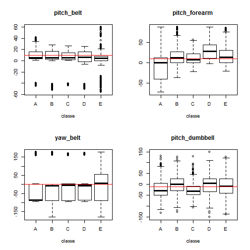
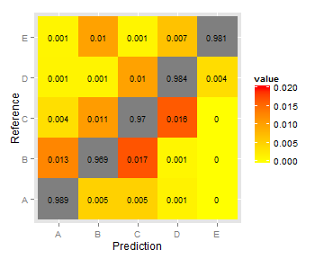

### Executive Summary

In this short paper we describe how physics is used to select a parsimonious set of variables from activity monitors resulting in highly accurate classification of free weight exercise.  The random forest model produced in essentially *a single iteration* was far superior to the highly optimized model of the original authors.  Our model used only 9 prediction variables but was optimized on 75% of the total data set resulting in a minimum 97% discrimination between prediction and actual classification when tested on the 25% testing set.  For exercises performed correctly, the out-of-sample error was only 1.1%.  For exercises performed incorrectly the average out of sample error (assuming a uniform distribution of exercise errors) was 2.4%.  These errors are significantly lower than those of the original authors' work.  The model also produced 20/20 hits on the "unknown" set provided for the final test.  Another advantage of our model was to eliminate an entire sensor, the "arm" sensor, from the data being considered and to use only the Euler angle means (pitch, roll and yaw) on the other 3 sensors (forearm (or glove), belt and dumbbell) to obtain the results.

### Background: A previous approach

Data for this study is from Ugulino, Cardador et. al [1].  A paper [2] describes the authors' model on this data as consisting of 17 of the most relevant features based on an algorithm by Hall [3].  The model employed was a random forest and included using the Bagging method.  The features used include many that are seemingly irrelevant from the simple physics of the problem.  The classifications of the exercise are described as:

* A) Exactly according to specifications
* B) Throwing the elbows to the front
* C) Lifting the dumbbell only halfway
* D) Lowering the dumbbell only halfway
* E) Throwing the hips to the front

Sensing this set of "errors" seems like a simple physics problem.  For example, lifting or lowering the dumbell the incorrect amount would result in a different mean of the "pitch" Euler angle.  The authors did not take into account even simple physics to construct their model, relying instead on statistical optimization. The problem with the authors' model appears to be that it was over optimized for the training set.  Statistics on the training set were very impressive and they showed a steady improvement as parameters were tweaked until false positive rate (FPR), area under the curve (AUC) and precision were 98.2%, 99.9% and 98.2% respectively.  However using a test set formed according to the leave-one-subject-out, the confusion matrix showed a different story.  Discrimination between prediction and actual was between 74% and 86%.  The authors attributed the lack of success to a small training sample size of 1800 used to construct the original model.  We gather from this that, because of the large number of features in the model, model construction time must have been prohibitive if the entire data set  of 19622 observations (or even some large proportion of it) were used.

In summary we think the key failings in this previous attempt at modeling the data were as follows:

* Too many features were selected on which to base the models.
* The feature selection was based on an opaque statistical process.
* The large feature set made model determination too costly to use the entire data set.
* The optimization performed to obtain the best metrics actually over-fit the model to training set data.
* The final result on the test set was not used to re-examine the assumptions under which the model was constructed.

### A Superior Approach: Modeling Using Physics

Our approach was significantly different from what appeared to us to be a purely statistical approach by the original group.  Instead of using an algorithm to select data, we looked at the classifications A-E and imagined which measurements may shed light on each of them individually.  We then constructed boxplots to test the hypotheses.  If it appeared that one measurement discriminated one class from all of the others, then this was judged to be a good feature to use in either a linear model or a random forest model [3],[4]. Linear models were not effective and so we quickly changed to the random forest approach.

To use physics, one must understand what the monitors are measuring.  To us, the only unambiguously understandable features in the data set are the roll, pitch and yaw of the various sensors. Although random forest models are somewhat opaque, the features going into them do not need to be.   

One beneficial offshoot of this analysis was to completely discard the "arm" sensor data which didn't seem to help discriminate the various failure modes from each other.  The resulting random forest model contains only 9 variables and is thus able to be optimized over the entire training set (75% of the 19622 original observations). The small number of features made the optimization relatively fast - only 13.3 min. on a 3GHz core i5-2320 CPU. But what was most surprising was that *the very first iteration of the random forest model produced the final model*.  Not only did this insure that we obtained good results on the training set but it also significantly reduced the danger of optimization for a specific data set.  Indeed, when tested on a large and wholly untouched test set we were able to obtain nearly perfect results for 2 of the 5 quality classes and no worse than 96% on the worst of the other 3 classes.  Although this probably could have been improved, the lesson of the previous authors' over-optimization made us reluctant to optimize further.  

### Full Reproducible Model Development

This section goes through the step-by-step development described above.  First we read in the data and generate the test and training sets, then we explore some of the features and finally we construct the model and evaluate it against the test set.

#### Reading and partitioning training and test sets

First we need to read in the data from the original source and partition test and training sets.  A final test set, containing the "unknown" 20 test cases is also read in.  Note that the dimension of the partitioned training set includes 14,718 observations on 160 variables.


```r
library(caret); library(kernlab); library(e1071); library(reshape2)
```

```
## Loading required package: lattice
```

```r
setwd("C:/Users/Marko/Documents/Learning/Johns Hopkins/R_Work")
if(!file.exists("pml-training.csv")){
    download.file("https://d396qusza40orc.cloudfront.net/predmachlearn/pml-training.csv", "pml-training.csv")
}
if(!file.exists("pml-testing.csv")){
    download.file("https://d396qusza40orc.cloudfront.net/predmachlearn/pml-testing.csv", "pml-testing.csv")
}

weightlift <- read.csv("pml-training.csv")
finaltest <- read.csv("pml-testing.csv")

set.seed(95720)
inTrain <- createDataPartition(y=weightlift$classe, p=0.75, list=FALSE)
training <- weightlift[inTrain,]
testing <- weightlift[-inTrain,]
dim(training)
```

```
## [1] 14718   160
```

#### Feature selection

An example of the exploration used for feature selection is shown in the boxplots below.  Note that classe E represents "throwing the hips in front".  This failure mode shows up in two variables, "pitch belt" and "yaw belt", in other words, a twisting of the waist and a thrusting of the waist.  The horizontal line in the "yaw belt" plot marks the condition where *nearly all* of the data for classe A, B, C and D is below the line while more than 40% of E is above the line.  This is a very good "filter".  Similarly, "pitch forearm" discriminates both class A (correct technique) and class C (lifting the dumbbell only halfway) from each other and from all the others so this is a particularly valuable feature.


```r
layout(matrix(c(1,2,3,4),2,2))
xlab = "classe"
boxplot(pitch_belt ~ classe, data = training, main = "pitch_belt", xlab = xlab)
abline(h = 10, col = "red")
boxplot(yaw_belt ~ classe, data = training, main = "yaw_belt", xlab = xlab)
abline(h = 0, col = "red")
boxplot(pitch_forearm ~ classe, data = training, main = "pitch_forearm", xlab = xlab)
abline(h = 10, col = "red")
boxplot(pitch_dumbbell ~ classe, data = training, main = "pitch_dumbbell", xlab = xlab)
abline(h = -10, col = "red")
```

 

Fig. 1 - Boxplots of of variables for individually recorded exercise errors ("classe").  The red lines are roughly drawn where they give largest contrast between one "classe" and the others.

#### Model Determination and Evaluation

The code below shows the random forest model construction.  The model is then used to predict the "classe" of the test set and then compared to the "classe" variable in the test set. There are a couple of technical points to be noted in the model construction.  First, we found that it was **not** sufficient to set the pseudorandom seed only in the first chunk of this markdown document.  When we did so, we obtained different results each time the model below ran.  As a result, there is a second call to set.seed just before the random forest model call. Second, it was useful to place the model call in the if statement so that editing of text and graphics could be done quickly without recalculating the model.  Once the final edit was performed we set the model back to "TRUE" and reran the model to display an accurate elapsed time.  This is also shown below.

The confusion matrix is shown below and displays the key quality metrics of the model.  The final table is a constructed *normalized* confusion matrix.  It is easier to see the efficacy of the model in this normalized view.


```r
# Change the next statement to FALSE if modelFit is unchanged, TRUE if modelFit needs to be recalculated
# This is to speed up editing when the model is optimized
start <- Sys.time()
set.seed(150917)
if(TRUE){modelFit <- train(classe ~ roll_belt + yaw_belt + pitch_belt + roll_forearm + yaw_forearm + 
            pitch_forearm + pitch_dumbbell + yaw_dumbbell + roll_dumbbell, method = "rf", data = training)
}
```

```
## Loading required package: randomForest
## randomForest 4.6-10
## Type rfNews() to see new features/changes/bug fixes.
```

```r
end <- Sys.time()
print("Elapsed time for model generation:")
```

```
## [1] "Elapsed time for model generation:"
```

```r
print(end - start)
```

```
## Time difference of 13.32081 mins
```

```r
pred <- predict(modelFit, newdata = testing)
m <- confusionMatrix(pred, testing$classe)

print(m)
```

```
## Confusion Matrix and Statistics
## 
##           Reference
## Prediction    A    B    C    D    E
##          A 1379   12    3    1    1
##          B    7  920    9    1    9
##          C    7   16  829    8    1
##          D    2    1   14  791    6
##          E    0    0    0    3  884
## 
## Overall Statistics
##                                          
##                Accuracy : 0.9794         
##                  95% CI : (0.975, 0.9832)
##     No Information Rate : 0.2845         
##     P-Value [Acc > NIR] : < 2e-16        
##                                          
##                   Kappa : 0.974          
##  Mcnemar's Test P-Value : 0.04227        
## 
## Statistics by Class:
## 
##                      Class: A Class: B Class: C Class: D Class: E
## Sensitivity            0.9885   0.9694   0.9696   0.9838   0.9811
## Specificity            0.9952   0.9934   0.9921   0.9944   0.9993
## Pos Pred Value         0.9878   0.9725   0.9628   0.9717   0.9966
## Neg Pred Value         0.9954   0.9927   0.9936   0.9968   0.9958
## Prevalence             0.2845   0.1935   0.1743   0.1639   0.1837
## Detection Rate         0.2812   0.1876   0.1690   0.1613   0.1803
## Detection Prevalence   0.2847   0.1929   0.1756   0.1660   0.1809
## Balanced Accuracy      0.9918   0.9814   0.9808   0.9891   0.9902
```

```r
# Normalized Confusion matrix
mn <- sweep(m$table, 2, colSums(m$table), FUN="/")

mn_melt <- melt(mn)

library(ggplot2)

sp4 <- ggplot(mn_melt, aes(x=Prediction, y=Reference, fill = value, label=round(value,3)))+
    geom_tile(aes(fill=value)) + scale_fill_gradient(low="white", high="blue", limits = c(0.95, 1.00)) +  
    scale_fill_gradient(low="yellow", high="red", limits = c(0.0,0.02))
```

```
## Scale for 'fill' is already present. Adding another scale for 'fill', which will replace the existing scale.
```

```r
sp4 + geom_text(size = 3)
```

 

Fig. 2 - Normalized confusion matrix showing "classe" model predictions on the x axis and actual "classe" results on the y axis.  

### Conclusion

In this paper we have described how physics is used to select a parsimonious set of variables from activity monitors resulting in highly accurate classification of free weight exercise.  The random forest model, produced with minimal optimization beyond careful selection of the features, was far superior to the highly optimized model of the original authors.  Our model used only 9 prediction variables but was optimized on 75% of the total data set resulting in a minimum 96.9% discrimination between prediction and actual classification when tested on the 25% testing set.  The parsimonious set of variables resulted in the model being generated in less than 15 min.  It also produced 20/20 hits on the "unknown" set provided for the final test.  Another advantage of our model was to eliminate an entire sensor, the "arm" sensor, from the data being considered and to use only simple, understandable variables, the Euler angle means (pitch, roll and yaw), on the other 3 sensors (forearm (or glove), belt and dumbbell) to obtain the results.

### References

 [1] Ugulino, W.; Cardador, D.; Vega, K.; Velloso, E.; Milidiu, R.; Fuks, H. **Wearable Computing: Accelerometers' Data Classification of Body Postures and Movements**. Proceedings of 21st Brazilian Symposium on Artificial Intelligence. Advances in Artificial Intelligence - SBIA 2012. In: Lecture Notes in Computer Science. , pp. 52-61. Curitiba, PR: Springer Berlin / Heidelberg, 2012. ISBN 978-3-642-34458-9. DOI: 10.1007/978-3-642-34459-6_6.
 
 [2] Velloso, Eduardo, et al. "Qualitative activity recognition of weight lifting exercises." Proceedings of the 4th Augmented Human International Conference. ACM, 2013.
 
 [3] M.A. Hall. *Correlation-based Feature Subset Selection for Machine Learning.* PhD thesis, Department of Computer Science, University of Waikato, Hamilton, New Zealand, apr. 1999.
 
 [4] Breiman L: Random Forests.  Machine Learning 2001, 45:5-32.
 
 [5] Liaw, Andy, and Matthew Wiener. "Classification and regression by randomForest." R news 2.3 (2002): 18-22.
